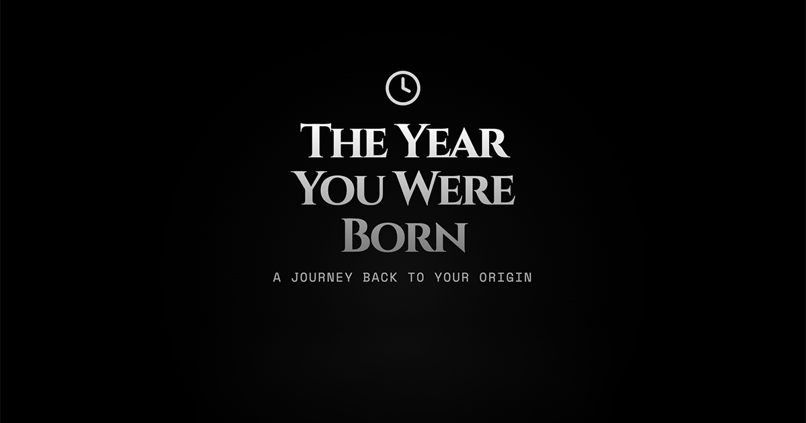

# The Year You Were Born

An interactive web experience that brings the past to life. This project showcases the use of **web animations** to tell engaging stories, guiding users through significant events and cultural moments from their birth year with immersive visual storytelling.

This contains everything you need to run your app locally.

View your app in AI Studio: https://ai.studio/apps/drive/1VBsPD-VvS_MfXv2KxMEbpzIatHWz0eXZ

## Run Locally

**Prerequisites:**  Node.js

1. Install dependencies:
   `npm install`
2. Set the `GEMINI_API_KEY` in [.env.local](.env.local) to your Gemini API key
3. Run the app:
   `npm run dev`
